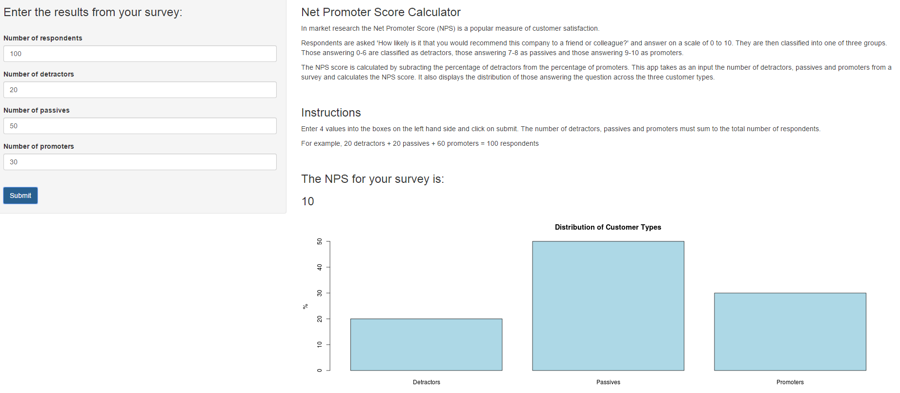

</br>
# Introduction to the NPS
</br>
The Net Promoter Score (NPS) is used in market research to measure customer loyalty.    
</br>
Customers are asked 'How likely is it that you would recommend this company to a friend or colleague?' and answer on a scale of 0-10 where 0 = Extremely unlikely and 10 = Extremely likely.  
</br>
Those answering 0-6 are classified as detractors, those answering 7-8 as passives and those answering 9-10 as promoters.  
</br>
The subject of this presentation is to introduce a simple shiny app that calculates the NPS based on responses to this question and displays a bar chart of customer classifications.  
</br>
Further details about the NPS can be found at this wikipedia page.  
</br>
https://en.wikipedia.org/wiki/Net_Promoter

--- .class #id
</br>
# The NPS calculation in R
</br>
In R the NPS calculation can be reproduced with the following expression


```r
((promoters/respondents)-(detractors/respondents))*100
```
</br>
So an input of 750 respondents with 480 promoters and 150 detractors would result in an NPS score of 44.


```r
respondents <- 750
promoters <- 480
detractors <- 150

((promoters/respondents)-(detractors/respondents))*100
```

```
## [1] 44
```

---
</br>
# What the app does
</br>
The shiny app requires 4 non negative numbers to be entered via numeric inputs.  
</br>
The 4 numbers are the number of detractors, the number of passives, the number of promoters and the overall number of respondents.  
</br>
Once the user has clicked submit, the app first checks that the input is valid by checking that the sum of detractors, passives and promoters is equal to the total number of respondents. If an acceptable input has not been received then a message reminding the user what is required is displayed.  
</br>
Once a valid input has been entered the NPS score is calculated and displayed to the user. A bar chart is also generated showing how the three customers types are distributed in the overall number of respondents.

---
</br>
# In Conclusion  
</br>
The NPS Calculator App can be used by market researchers to quickly grab an NPS score and to get a visual impression of how the customer types compare.  
</br>
The interface is simple and employs twitter's bootstrap framework for mobile compatibility.  
</br>

